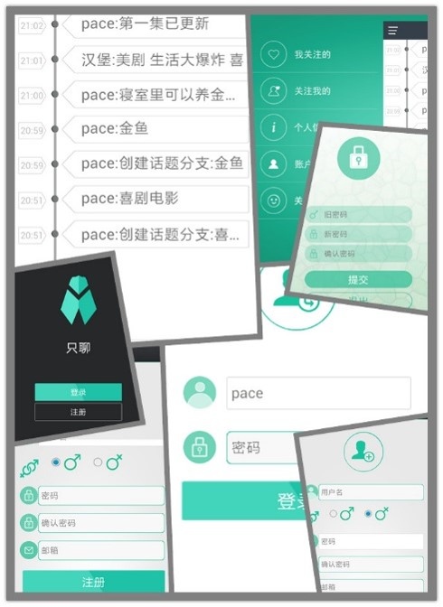

# ZhiLiao

Messenger Application on Android platform.  
Developed in Sophomore summer(2015.7-2015.9) in a team of four.  
@Silencious is responsible for the frontend logic, version control and QA.  
@riaqn is responsible for the backend and network API.  
Two other members are responsible for the frontend UI and animations.  

You can try to clone this project and build it, or just download the apk.  
Note: server is offline. You need to deploy the server and configure the client if you want to run the app.  

## Relative Links
[Repo](https://github.com/silencious/ZhiLiao)  
[Release](https://github.com/silencious/ZhiLiao/releases)  
